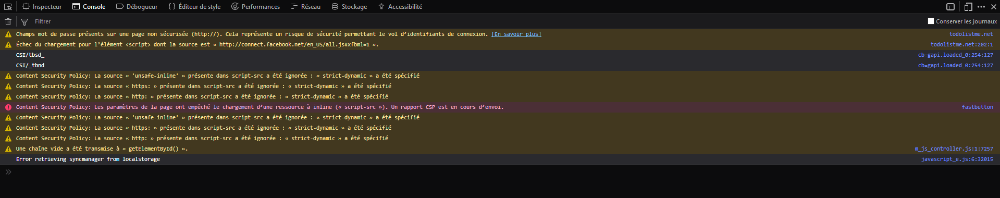
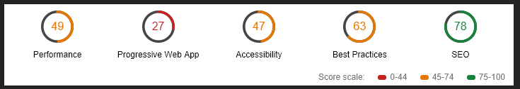
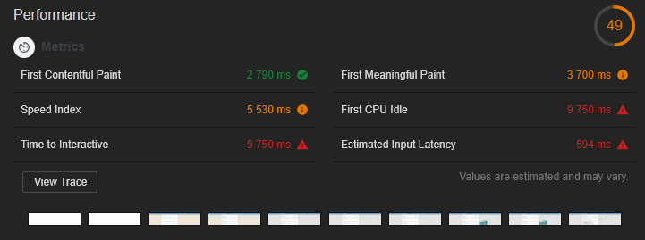

# Audit de Performance : [Site concurrent](http://todolistme.net/)

## Sommaire

1. [Console](#console)
2. [DevTools Chrome](#devTools)
  1. [Performance](#subPerformance)
  2. [PWA](#subPWA)
  3. [Accessibilité](#subAccess
3. [Conclusion](#conclusion)

## Console 

On note la présence d'erreurs et de warnings dans la console du navigateur. Les warnings sont dus à l'utilisation du protocole HTTP et non pas HTTPS.

Il existe également une erreur due à un *id* non présent dans un élément HTML.

Et enfin, on constate trois *console.log()* qui ne donnent pas un rendu propre et optimisé.

## DevTools Chrome 

L'analyse du navigateur décompose la performance en plusieurs catégories. Nous pouvons d'ores et déjà observer une sous-performance dans trois catégories (Performance, Accessibilité et Best Practices) et une catégorie en véritable difficulté (Progressive Web App).

### Performance 

__Positif__ : 

* Les images sont exploitées en .png et de bonnes tailles pour ne pas alourdir le chargement
* Le DOM et le CSS n'ont pas une taille trop importante
* La publicité est bien implémentée et ne ralentir pas énormément le chargement

__Négatif__ : 
* Le site total est un peu long à charger (4,39 secondes, Google recommande 4 secondes maximum)
* Le site ne précharge pas les images et en utilise beaucoup
* La librairie jQuery-ui (js  & CSS) n'est pas au format minifié
* La version utilisée de jQuery n'est pas à jour

__Opportunités__ : Précharger les images au sein des différents scripts javascript, et utiliser la version .min de jQuery permettrait un gain significatif de performance au chargement. Les images pourraient également être exploitées en sprites.

### Progressive Web App : 

__Positif__ : Pour un viewport Desktop, le contenu est bien configuré

__Négatif__ : 

* N'utilise pas le protocole HTTPS, ce qui provoque des erreurs et un potentiel risque de sécurité

* Il manque des attributs *alt* sur des images

* Le site n'est pas responsive et non utilisable en version mobile

__Opportunités__ : A l'heure actuelle, il est important de faire en sorte que son site soit multisupport, c'est-à-dire utilisable sur n'importe quel type d'écran. Cela permet une plus grande visiblité.

### Accessibilité 

__Positif__ : Le code est bien construit, il utilise correctement les attributs ; les navigateurs comprennent les descriptions.

__Négatif__ : 
* Les balises <form></form> n'ont pas d'attribut label associé.
* Certains id ne sont pas uniques
* La balise <html></html> n'a pas d'attribut lang

__Opportunités__ : Avoir un code bien construit permet au navigateur de mieux l'interpréter et de gagner une meilleure visibilité sur le web. De plus, étant donné qu'il existe plusieurs types de support (tablettes, smartphones, desktop...), il est essentiel d'avoir un code bien rédigé pour qu'il soit compréhensible de tous.

## Conclusion 
Le site de nos concurrents possède plusieurs problèmes intéressants qui nous interrogent sur notre propre site web. De même, il est aussi bénéfique de comparer les points positifs afin de nous assurer que notre site est aussi performant que possible.

Après cet audit, il est en mon sens essentiel d'optimiser la performance du site. De même, l'axe responsive peut-être une expansion bienvenue, car si les éléments se redimensionnent sur notre Todo, elle reste tout de même inutilisable sur plus petit écran. 
