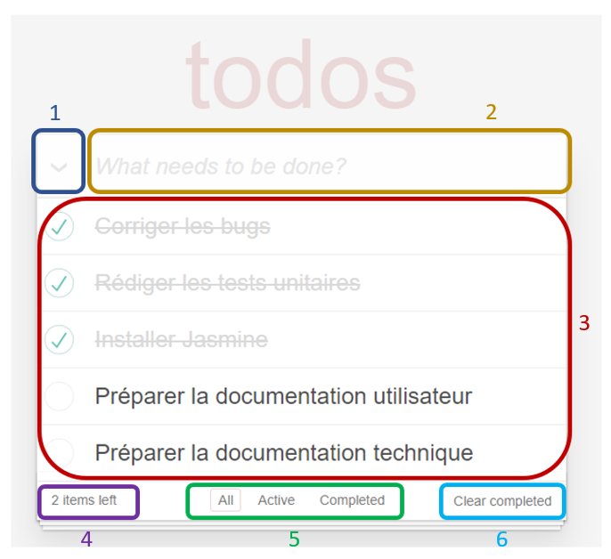
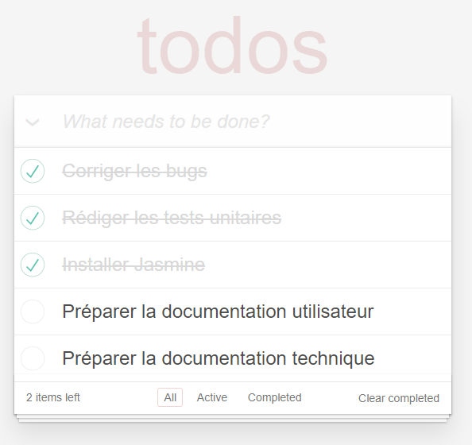
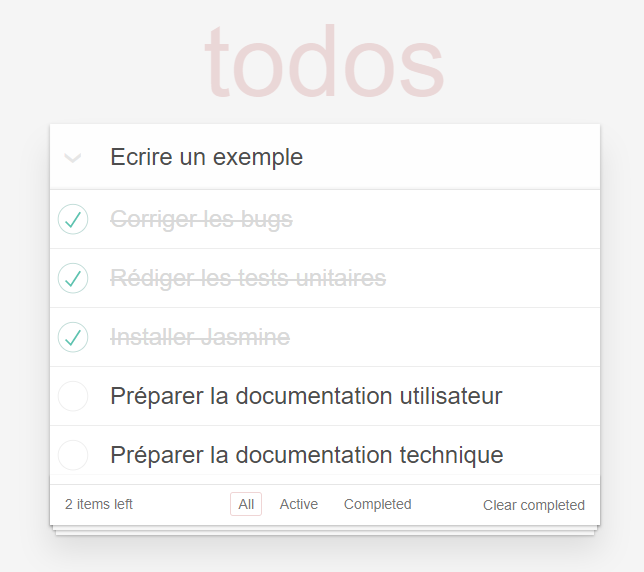
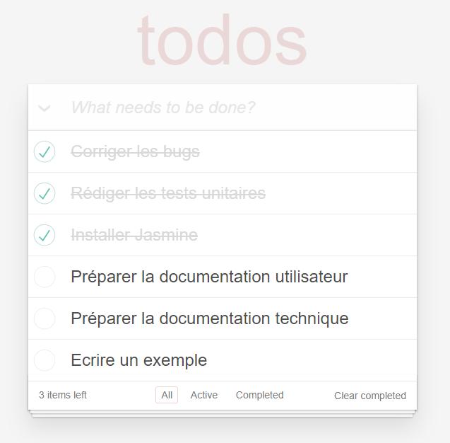
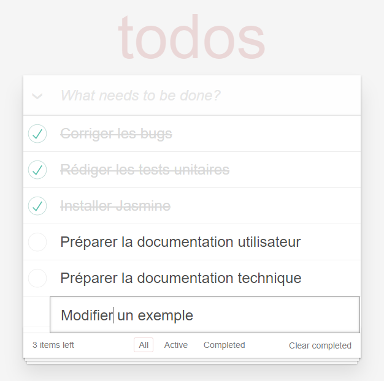
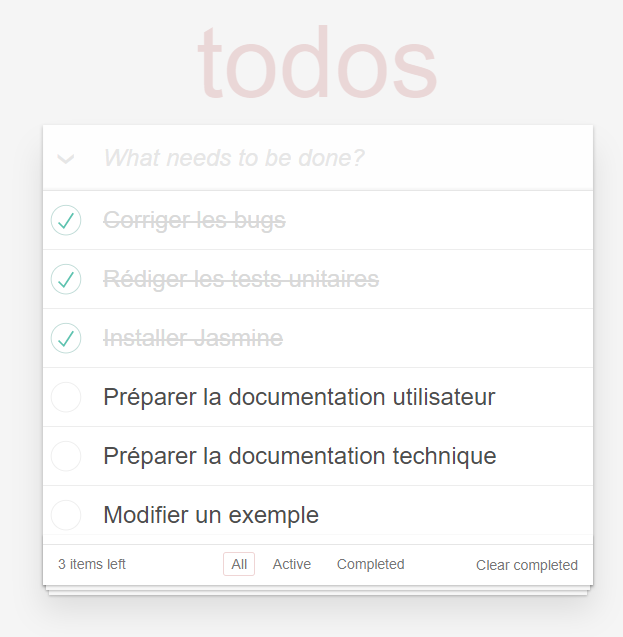
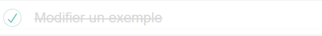
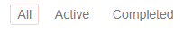
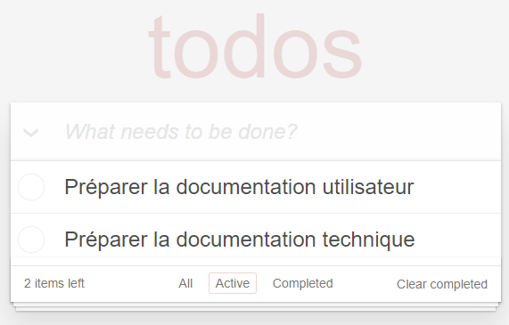
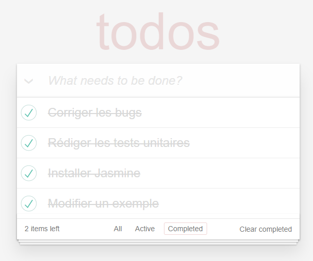

# Utilisation du site
Le site web Todos permet de créer, de modifier, et de suivre sa todo liste. Chaque entrée dans la todo peut être modifiée, marquée comme complétée, et remise en active.  
Par ailleurs, le site garde en mémoire la todo liste jusqu'à la prochaine utilisation. 

## Sommaire : 
1. [Présentation de la page web](#presPage)
2. [Ajouter une entrée](#ajout)
3. [Modifier une entrée](#modif)
4. [Rendre une entrée dite "active" en "complétée"](#complet)
5. [Changer de filtres](#filtres)

## Présentation de la page web 

1. __L'encoche__ : Permet de cocher/décocher toutes les entrées de la todo liste

2. __Zone d'écriture__ : Permet d'écrire une nouvelle entrée

3. __Zone d'affichage__ : Montre toutes les entrées de la todo liste, complètes, ou actives en fonction du filtre choisi

4. __Nombre d'entrées__ : Comptabilise le nombre d'entrées encore actives

5. __Filtres__ : Permet de filtrer la todo liste pour afficher toutes les entrées, les entrées actives uniquement ou les entrées complétées uniquement

6. __Supprimer__ : Bouton qui permet d'effacer les entrées complètes et de laisser uniquement les entrées actives

## Ajouter une entrée 
On se place dans la zone de texte : 

On rédige son entrée : 

Pour l'ajouter, on appuie sur la touche Entrée du clavier et elle s'ajoute à la fin de la liste des entrées de la todo liste : 

## Modifier une entrée 

Il nous suffit de double cliquer sur l'entrée à modifier : 

Une fois le texte modifié, on appuie encore une fois sur la touche Entrée pour la rendre valide :

## Rendre une entrée dite "active" en "complétée" 

A gauche de l'entrée, on remarque une case à cocher. Il suffit de cliquer sur cette case à cocher pour que l'entrée soit en complétée : 

## Changer de filtres 

En bas de la todo liste, il existe trois filtres :

* All : sélectionne toutes les entrées, actives ou complétées. Ce filtre est sélectionné par défaut
* Active : Montrera uniquement les entrées actives 

* Completed : Montrera uniquement les entrées complétées

